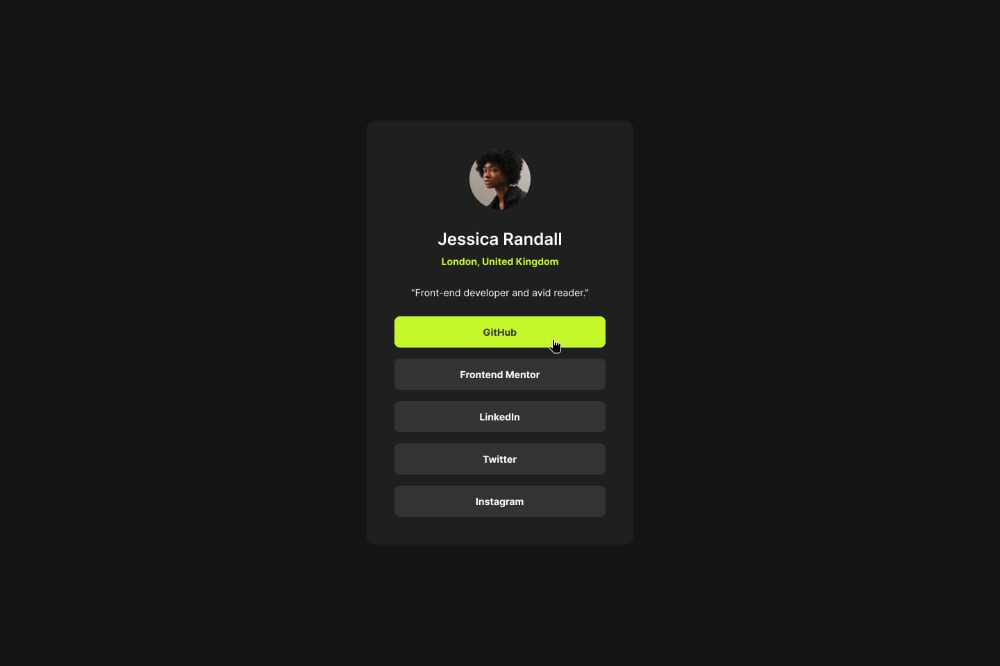

# Frontend Mentor - Social links profile solution

This is a solution to the [Social links profile challenge on Frontend Mentor](https://www.frontendmentor.io/challenges/social-links-profile-UG32l9m6dQ). Frontend Mentor challenges help you improve your coding skills by building realistic projects. 

## Table of contents

- [Overview](#overview)
  - [The challenge](#the-challenge)
  - [Screenshot](#screenshot)
  - [Links](#links)
- [My process](#my-process)
  - [Built with](#built-with)
- [Author](#author)

## Overview

### The challenge

Users should be able to:

- See hover and focus states for all interactive elements on the page

### Screenshot
Active state

Desktop preview

Desktop design

Mobile design

### Links

- Solution URL: [View Demo](https://github.com/Dunniola/Social-links-profile.git)
- Live Site URL: [Github App]()

## My process

### Built with

- Semantic HTML5 markup
- CSS custom properties
- Flexbox
- CSS Grid
- Mobile-first workflow.

## Author

- Website - [Dunniola]()
- Frontend Mentor - [@Dunniola](https://www.frontendmentor.io/profile/Dunniola)
- Twitter - [@Eduoladunni](https://www.twitter.com/Eduoladunni)

